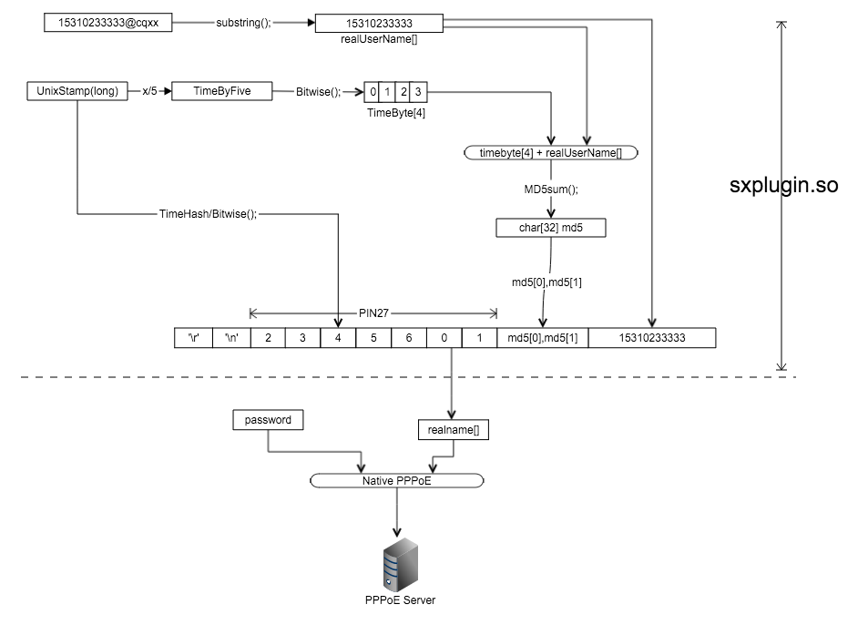

#Openwrt-NetKeeper


###Overview

This is an algorithm(C/Linux) to generate the real username during PPPoE. I disassembled the code from the Android version , modified it to run the algorithm on OpenWRT.

这是一个基于OpenWRT的闪讯拨号算法的实现。通过对Android版的反编译，获得到了拨号流程，并把它移植到OpenWRT上运行，~~实现打破毒瘤电信垄断的效果~~。

论坛见[这里](http://www.right.com.cn/forum/thread-141979-1-1.html)

心跳已经通过Android版反编译出来了，不过应该是烂尾了，找工作没时间移植了（用脚本语言发套接字就可以）.... <https://github.com/miao1007/android-netkeeper>


###How Does It Work


###Features
1. 算法非常有效率，基于位运行优化，嵌入式设备也能轻松运行；
2. 可移植强，仅有的几个库文件在任何设备均可使用；
2. 支持多地区登录，同时支持武汉E信，重庆，杭州，南昌(V18)，海南地区的帐号登录，有更多需求的可以提issue；
3. 自适应帐号长度，支持带后缀与不带后缀的运算；
4. 支持原厂、PandoraBox。

###Before Start
* Install a 64-bit Ubuntu on your PC or Virtual-Machine
* Download the [Lastest GCC](https://github.com/miao1007/Openwrt-NetKeeper/wiki#2-%E5%A6%82%E4%BD%95%E4%B8%8B%E8%BD%BDgcc)


###Getting Start

1. Git clone and **read** the code. Remember to modify you radius in source code.

2. Unzip the GCC to anywhere
		
4. edit /src/makefile, change the defalut `CC` and `-I`  to your GCC‘s location

```
#Get Lastest GCC in http://downloads.openwrt.org/snapshots/trunk/
#This is a demo for Netgear WNDR3800(AR71XX)

#TODO : Change the location for your GCC’s location
CC=/home/leon/netkeeper/OpenWrt-Toolchain-ar71xx-for-mips_34kc-gcc-4.8-linaro_uClibc-0.9.33.2/toolchain-mips_34kc_gcc-4.8-linaro_uClibc-0.9.33.2/bin/mips-openwrt-linux-gcc
CFLAGS=-Os -Wall

all:sxplugin.so

sxplugin.so:
$(CC) $(CFLAGS) sxplugin.c -fPIC -I/home/leon/netkeeper/OpenWrt-Toolchain-ar71xx-for-mips_34kc-gcc-4.8-linaro_uClibc-0.9.33.2/toolchain-mips_34kc_gcc-4.8-linaro_uClibc-0.9.33.2/include -shared -o sxplugin.so
```

5. run `make` in terminal

3. Upload your "sxplugin.so"

		scp  {drag your `.so` file here}   root@192.168.1.1:/usr/lib/pppd/2.4.7/

4. Configure your router

		ssh root@192.168.1.1
		vi /etc/config/network


	To configure your wan interface
	
		config interface 'NetKeeper'
        	option proto 'pppoe'
        	option ifname 'eth0.2'
        	option pppd_options 'plugin sxplugin.so'
        	option username 'phone number'
        	option password 'xxxxx'
        	option metric '0'
    
5. sync your router's time.

6. reconnect your NetKeeper interface in Luci

##Troubleshooting

1. Search wiki before ask question <https://github.com/miao1007/Openwrt-NetKeeper/wiki>
2. Submit new [issue](https://github.com/miao1007/Openwrt-NetKeeper/issues/new) with your Log in OpenWRT.

##Acknowledgements
* [NETKEEPER ON WINDOWS](http://www.purpleroc.com/html/507231.html)
* [CQUPT NETKEEPER](http://bbs.cqupt.edu.cn/nForum/#!article/Unix_Linux/13624)

##Developed By
Leon - <miao1007@gmail.com>

##License

GPL
